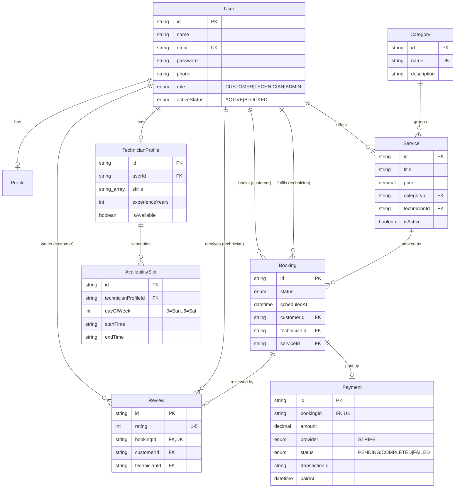
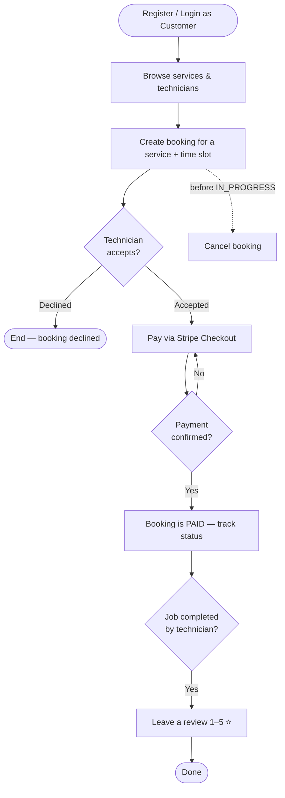
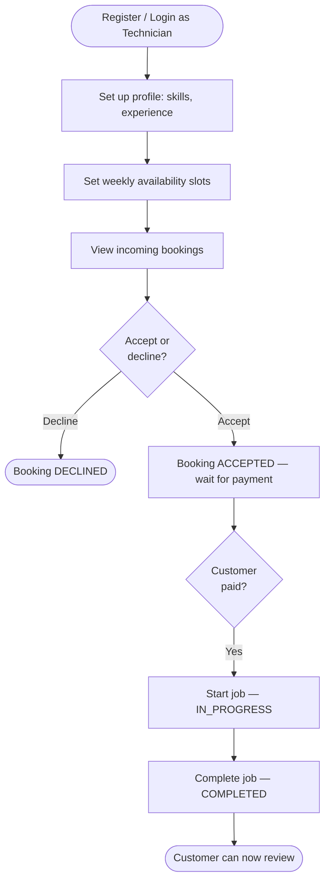
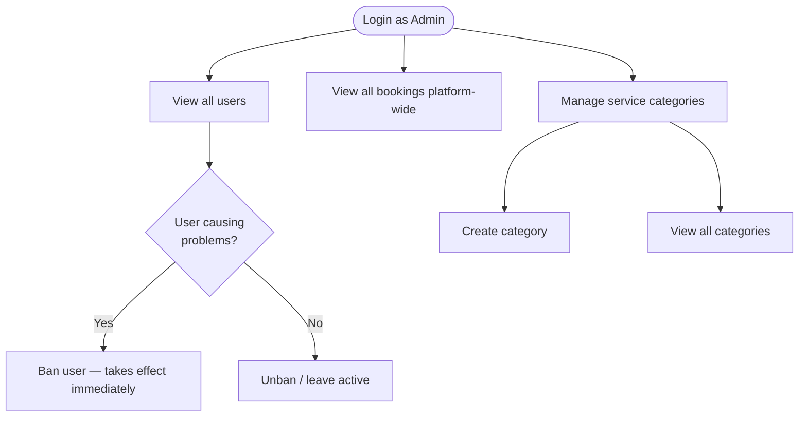
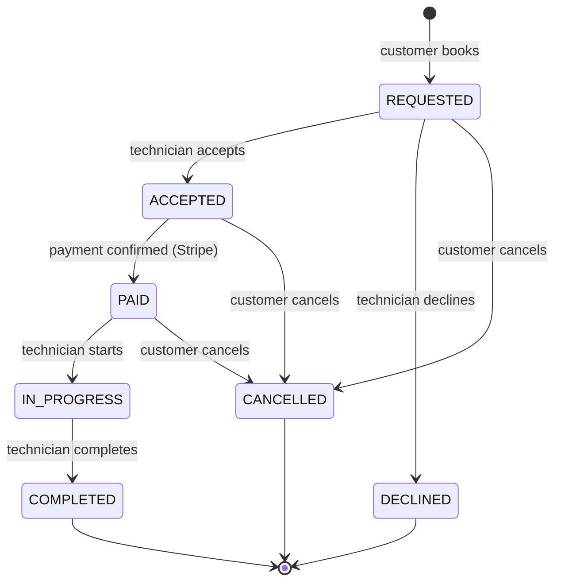
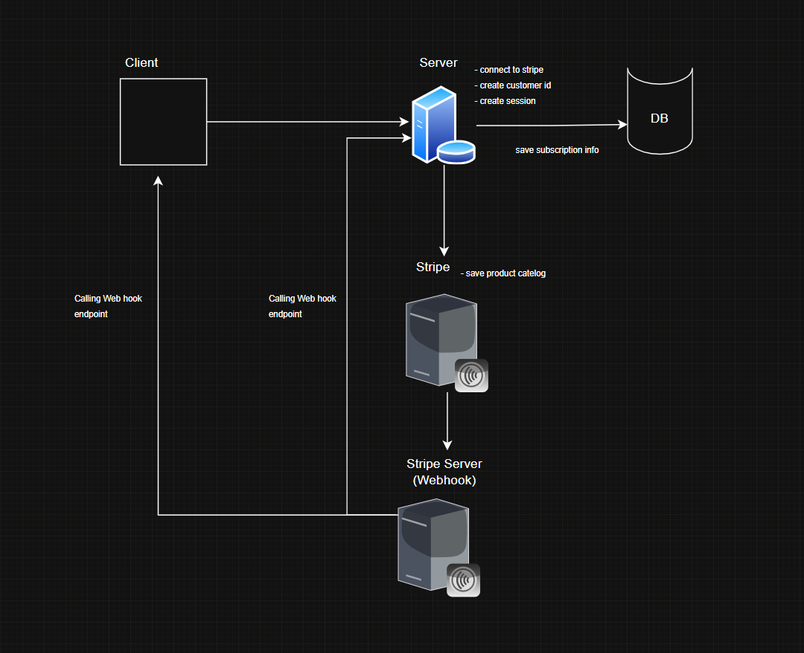

# FixMate 🔧

**A backend API for a home-services marketplace.** Customers browse available services (plumbing, electrical, cleaning, painting, …), book trusted technicians, pay securely, and leave reviews. Technicians create service profiles, manage their availability, and handle job bookings. Admins oversee the platform, manage users, and moderate service categories.

<p align="center">
  <a href="https://fixmate-backend-hazel.vercel.app">Live API</a> ·
  <a href="./postman/FixMate.postman_collection.json">Postman Collection</a> ·
  <a href="#api-endpoints">API Reference</a> ·
  <a href="#database-design">Schema</a> ·
  <a href="#flow-diagrams">Flow Diagrams</a>
</p>

---

## 🚀 Quick Start

```bash
# 1. Install
npm install

# 2. Configure — fill in DATABASE_URL, JWT secrets, Stripe keys, ADMIN_EMAIL/ADMIN_PASSWORD
cp .env.example .env

# 3. Set up the database schema
npx prisma migrate dev

# 4. Seed the admin account + a sample technician, category, and service
npm run seed

# 5. Run
npm run dev          # http://localhost:5000
```

**Verify it's up:** `GET http://localhost:5000/` → `{ "success": true, "message": "FixMate API is running" }`

> **Live deployment:** https://fixmate-backend-hazel.vercel.app
> **Seeded admin login:** `admin@fixmate.dev` (or your `ADMIN_EMAIL`) / your `ADMIN_PASSWORD`

---

## 📋 Project Overview

Finding a plumber, electrician, or cleaner usually means asking around, calling a few numbers, and hoping someone reliable shows up and charges fairly — with no shared record of who did the work or whether payment happened first.

FixMate is the backend that fixes this by putting three actors in one system with a single source of truth for every job — from request, to payment, to review:

- **Customers** browse services and technicians, book a job, pay via Stripe once it's accepted, track status, and review the work.
- **Technicians** advertise skills and availability, get discovered, and manage incoming jobs through their whole lifecycle.
- **Admins** keep the platform trustworthy — manage users, oversee every booking, and moderate the category list everyone browses by.

**A booking follows one server-enforced path** — the client can never skip a step:

```
REQUESTED ──▶ ACCEPTED ──▶ PAID ──▶ IN_PROGRESS ──▶ COMPLETED
    │            │
    ▼            ▼
CANCELLED    DECLINED
```

---

## 👥 Roles & Permissions

Users **select their role at registration** (`CUSTOMER` or `TECHNICIAN`). `ADMIN` is **not** self-registerable — admin accounts are provisioned directly (seeded), so nobody can grant themselves admin through a public endpoint.

| Role | Description | Key permissions |
|---|---|---|
| **Customer** | The person who needs a job done. | Browse services/technicians · book a job · pay via Stripe · track status · cancel (before `IN_PROGRESS`) · review completed jobs · manage own profile |
| **Technician** | The service provider who fulfils jobs. | Create/update service profile (skills, experience) · set availability slots · view incoming bookings · accept/decline · move a job through `IN_PROGRESS` → `COMPLETED` |
| **Admin** | The platform moderator. | View all users · ban/unban users · view all bookings · manage (view/create) service categories |

---

## 🛠 Tech Stack

| Layer | Technology |
|---|---|
| **Runtime / API** |    |
| **Database / ORM** |   |
| **Auth** |  — access + refresh tokens,  password hashing |
| **Validation** |  — enforced server-side on every write |
| **Payments** |  — Checkout Sessions + signed webhooks |
| **Deployment** |  — serverless |

---

## ✨ Features

### 🌐 Public

- Browse all available services and technicians
- Search and filter by service type, category, and search term
- View technician profiles with service details and reviews
- View all service categories

### 🙋 Customer

- Register and login as a customer
- Book a technician for a specific service and time slot
- Make payments via **Stripe** after a booking is accepted
- View payment history and payment status
- Track booking status through its lifecycle
- Cancel a booking (before it reaches `IN_PROGRESS`)
- Leave a review after job completion
- Manage own profile and password

### 🔧 Technician

- Register and login as a technician
- Create and update service profile (skills, experience, availability flag)
- Set availability time slots (weekly schedule)
- View incoming bookings
- Accept or decline bookings
- Mark jobs as in-progress or completed

### 🛡 Admin

- View all users (customers and technicians)
- Manage user status (ban / unban) — effective immediately
- View all bookings platform-wide
- Manage service categories (view / create)

---

## 🔌 API Endpoints

Base URL: `http://localhost:5000` (local) · `https://fixmate-backend-hazel.vercel.app` (live).
All endpoints are prefixed with `/api`. Protected routes require `Authorization: Bearer <accessToken>`.

### Authentication

| Method | Endpoint | Who | Description |
|---|---|---|---|
| `POST` | `/api/users/register` | Public | Register a new user (customer/technician); technician also gets an empty profile |
| `POST` | `/api/auth/login` | Public | Login, returns access + refresh JWTs |
| `POST` | `/api/auth/refresh-token` | Refresh cookie | Issue a new access token |
| `POST` | `/api/auth/logout` | Public | Clear auth cookies |
| `GET` | `/api/auth/me` | Authenticated | Get the current authenticated user |

### Users (self-service)

| Method | Endpoint | Who | Description |
|---|---|---|---|
| `GET` | `/api/users/me` | Authenticated | Get own profile |
| `PATCH` | `/api/users/update-profile` | Authenticated | Update own name/phone + bio/photo/address |
| `PATCH` | `/api/users/update-password` | Authenticated | Change own password |

### Services & Technicians (Public)

| Method | Endpoint | Who | Description |
|---|---|---|---|
| `GET` | `/api/services` | Public | Get all services with filters (categoryId, searchTerm, pagination) |
| `GET` | `/api/services/:id` | Public | Get one service |
| `GET` | `/api/technicians` | Public | Get all technicians with filters |
| `GET` | `/api/technicians/:id` | Public | Get a technician profile with services and reviews |

### Categories

| Method | Endpoint | Who | Description |
|---|---|---|---|
| `GET` | `/api/categories` | Public | Get all service categories |
| `POST` | `/api/admin/categories` | Admin | Create a new service category |
| `GET` | `/api/admin/categories` | Admin | Get all categories (admin view) |

### Bookings

| Method | Endpoint | Who | Description |
|---|---|---|---|
| `POST` | `/api/bookings` | Customer | Create a new booking |
| `GET` | `/api/bookings` | Customer | Get the customer's own bookings |
| `GET` | `/api/bookings/:id` | Customer (owner) | Get booking details |
| `PATCH` | `/api/bookings/:id/cancel` | Customer (owner) | Cancel a booking (before `IN_PROGRESS`) |

### Payments (Stripe)

| Method | Endpoint | Who | Description |
|---|---|---|---|
| `POST` | `/api/payments/create` | Customer (owner) | Create a Stripe Checkout session for an accepted booking |
| `POST` | `/api/payments/confirm` | Stripe (webhook) | Confirm/verify payment via signed webhook |
| `GET` | `/api/payments` | Customer | Get the customer's payment history |
| `GET` | `/api/payments/:id` | Customer (owner) | Get payment details |

### Technician Management

| Method | Endpoint | Who | Description |
|---|---|---|---|
| `PUT` | `/api/technician/profile` | Technician | Update technician profile (skills, experience, availability) |
| `PUT` | `/api/technician/availability` | Technician | Replace the weekly availability slots |
| `GET` | `/api/technician/bookings` | Technician | Get the technician's assigned bookings |
| `PATCH` | `/api/technician/bookings/:id` | Technician | Update booking status (accept / decline / start / complete) |

### Reviews

| Method | Endpoint | Who | Description |
|---|---|---|---|
| `POST` | `/api/reviews` | Customer (owner) | Create a review after job completion (rating 1–5) |

### Admin

| Method | Endpoint | Who | Description |
|---|---|---|---|
| `GET` | `/api/admin/users` | Admin | Get all users |
| `PATCH` | `/api/admin/users/:id` | Admin | Update user status (ban / unban) |
| `GET` | `/api/admin/bookings` | Admin | Get all bookings |
| `GET` | `/api/admin/categories` | Admin | Get all categories |
| `POST` | `/api/admin/categories` | Admin | Create a new service category |

---

## 🗄 Database Design

**9 tables, one `User` table for everyone** (a `role` column decides capabilities), with a `TechnicianProfile` hanging off any user who is a technician.

### Database Tables

| Table | Stores |
|---|---|
| **Users** | User information, authentication details (hashed password), `role`, and `activeStatus` |
| **Profiles** | Per-user bio / photo / address, kept separate from login credentials (1:1 with Users) |
| **TechnicianProfiles** | Technician-specific info — skills, experience years, availability flag (1:1 with Users) |
| **AvailabilitySlots** | A technician's weekly schedule (dayOfWeek, startTime, endTime) — N per profile |
| **Categories** | Service categories (plumbing, electrical, cleaning, painting, …) |
| **Services** | Specific services offered by a technician under a category (title, price, isActive) |
| **Bookings** | Job bookings between a customer and technician for a service (with status + scheduledAt) |
| **Payments** | Payment transactions — `bookingId`, `amount`, `provider`, `status`, `transactionId`, `paidAt` |
| **Reviews** | Customer reviews for a completed booking (rating 1–5) — one per booking |

### Entity-Relationship Diagram



**Key relations:**
- `User 1:1 Profile` and `User 1:1 TechnicianProfile 1:N AvailabilitySlot`
- `Category 1:N Service N:1 User` (technician) — what's offered, by whom
- `Booking` is the hub: two FKs to `User` (customer *and* technician), one to `Service`, and `1:1` to both `Payment` and `Review`

> Full field-by-field reasoning (why each field, why optional, why one User table) lives in [`docs/AUTH_DESIGN_DECISIONS.md`](./docs/AUTH_DESIGN_DECISIONS.md).

---

## 🔀 Flow Diagrams

### Customer flow



### Technician flow



### Admin flow



### Booking state machine



### Payment flow (Stripe)

Payments run through **Stripe Checkout Sessions** — FixMate never touches a card number. It opens a secure Stripe-hosted checkout and only trusts that money changed hands when Stripe confirms it via a **signed webhook**, never when the client claims it paid.



1. **Client → Server:** customer calls `POST /api/payments/create` for an `ACCEPTED` booking.
2. **Server → Stripe:** server creates a Checkout Session for the service price and saves a `Payment` row (`PENDING`) with Stripe's session id as `transactionId`.
3. **Server → Client:** customer receives a real Stripe checkout URL and pays on Stripe's own page.
4. **Stripe → Server (webhook):** on completion Stripe calls `POST /api/payments/confirm` with a cryptographically signed event; the server verifies the signature before trusting it.
5. Only then does the `Payment` flip to `COMPLETED` and the `Booking` to `PAID`, unlocking the technician's "start job" step.

---

## 🧪 How to Test

1. **Import the Postman collection:** [`postman/FixMate.postman_collection.json`](./postman/FixMate.postman_collection.json). It's organised **by module** (Auth, User, Categories, Services, Technicians, Bookings, Payments, Reviews), with all variables collection-scoped and tokens auto-saved on login — you never copy a token by hand.

2. **Seed once** (`npm run seed`) to get the admin account plus a sample technician (`sam.technician@fixmate.dev` / `Secret123!`), a `Plumbing` category, and a `Kitchen sink repair` service — so `Bookings > Create` has something real to book immediately.

3. **Run a full journey:**
   - **User > Register** a customer, then **Auth > Login**.
   - **Bookings > Create** (as customer) → login as the technician → **Bookings > Update Status** = `ACCEPTED`.
   - Login as the customer → **Payments > Create** → pay the returned `checkoutUrl` with Stripe test card `4242 4242 4242 4242`.
   - Run the Stripe listener locally to receive the webhook: `npm run stripe:webhook`.
   - Login as technician → push status `IN_PROGRESS` → `COMPLETED`.
   - Login as customer → **Reviews > Create**.
   - Login as admin → **Get All Users / Bookings** to oversee everything.

4. **Every error** returns the same shape:
   ```json
   { "success": false, "message": "...", "errorDetails": null }
   ```
   Validation failures populate `errorDetails` with a list of `{ field, message }`.

---

## 📁 Project Structure

```
fixMate/
├── src/
│   ├── modules/          # one folder per resource (auth, user, booking, payment, …)
│   │                     # each has a README.md documenting its endpoints
│   ├── middlewares/      # auth, validation, global error handler
│   ├── lib/              # prisma client (with serverless retry)
│   ├── utils/            # AppError, sendResponse, query builder
│   └── app.ts
├── prisma/schema/        # multi-file Prisma schema (one .prisma per model)
├── postman/              # module-organised Postman collection
├── docs/                 # design decisions + assets
└── api/_entry.ts         # Vercel serverless entry
```
